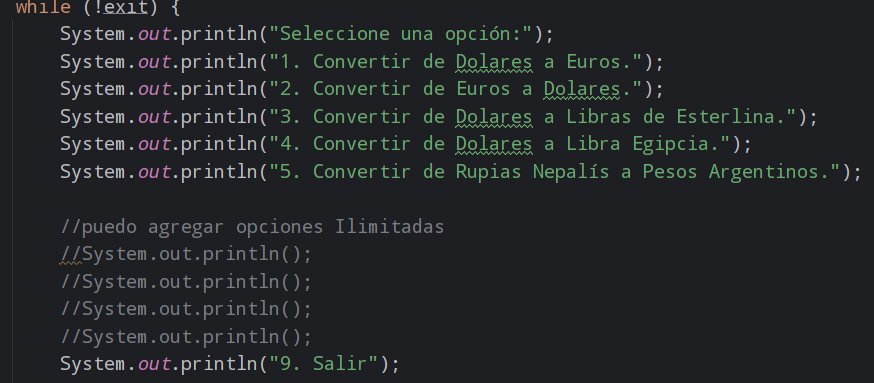
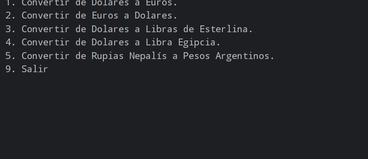
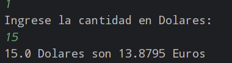
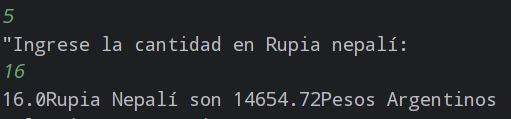
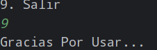

# Conversor de Monedas


## Índice

1. [Descripción del Proyecto](#descripción-del-proyecto)
2. [Estado del Proyecto](#estado-del-proyecto)
3. [Demostración de Funciones y Aplicaciones](#demostración-de-funciones-y-aplicaciones)
5. [Tecnologías Utilizadas](#tecnologías-utilizadas)
6. [Personas Contribuyentes](#personas-contribuyentes)
7. [Personas Desarrolladoras del Proyecto](#personas-desarrolladoras-del-proyecto)
8. [Licencia](#licencia)

## Descripción del Proyecto

Este Conversor de Monedas es una aplicación de consola en Java que permite convertir diferentes monedas utilizando la API de ExchangeRate-API. La aplicación proporciona una interfaz de lista para seleccionar las monedas y convertir cantidades entre ellas.
Tenemos varias Alternativas he incluso queda a código abierto con instrucciones para que puedan Agregar más.

## Estado del Proyecto


El proyecto está actualmente en desarrollo. Las funciones básicas de conversión de divisas están implementadas, pero se planean mejoras y nuevas características.

## Demostración de Funciones y Aplicaciones

1. **Convertir USD a EUR**:
    ```sh
    Ingrese la cantidad en USD: 100
    100 USD son 85 EUR
    ```

2. **Convertir EUR a USD**:
    ```sh
    Ingrese la cantidad en EUR: 85
    85 EUR son 100 USD
    ```
   ## Screenshots
### Agregar más Monedas.


### Como se ve.

### De Dolares a Euros.

### Una moneda Como las Rupias Nepalis.

### Nunca esta de más un gracias.



## Tecnologías Utilizadas

- **Java 17**
- **Maven**
- **Gson**
- **Apache HttpClient5**
- **ExchangeRate-API**

## Personas Contribuyentes


[Alqstorm](https://github.com/Alqstorm)

## Personas Desarrolladoras del Proyecto

[Alqstorm](https://github.com/Alqstorm)

## Licencia

Este proyecto está licenciado bajo la Licencia MIT. Ver el archivo [LICENSE](LICENSE) para más detalles.


